# Cyber Surakshya — Project Overview

> **Cyber Surakshya** (Nepali: *Cyber Protection*) is an AI-powered, multi-agent cybersecurity platform built in Python. It combines a classical machine-learning Intrusion Detection System (IDS) trained on the CICIDS2017 dataset with a LangGraph-based agentic orchestration shell, exposing predictions through a FastAPI backend and a minimal HTML/JS frontend.

---

## Table of Contents

1. [Project Vision & Status](#1-project-vision--status)
2. [System Architecture (Software Architect View)](#2-system-architecture-software-architect-view)
3. [Codebase Structure (Developer View)](#3-codebase-structure-developer-view)
4. [Module Deep-Dive](#4-module-deep-dive)
5. [Data & ML Pipeline](#5-data--ml-pipeline)
6. [Platform Domain Model](#6-platform-domain-model)
7. [LangGraph Orchestration Shell](#7-langgraph-orchestration-shell)
8. [API & Frontend](#8-api--frontend)
9. [Testing Strategy](#9-testing-strategy)
10. [Product Analysis (PM View)](#10-product-analysis-pm-view)
11. [Actionable Insights & Remaining Tasks](#11-actionable-insights--remaining-tasks)

---

## 1. Project Vision & Status

### Vision

Cyber Surakshya aims to evolve from a standalone ML-based IDS into a full **multi-agent cybersecurity operations platform**. The long-term architecture involves coordinating, detecting, analysing, deciding, responding, and learning agents — each developed incrementally and independently following clean-architecture discipline.

### Current Status (as of July 2026)

| Component | Status |
|---|---|
| CICIDS2017 preprocessing pipeline | ✅ Complete |
| ML training (RF, GB, DNN, VotingEnsemble) | ✅ Complete |
| Dual-layer Anomaly Detection (iforest + AE) | ✅ Complete — trained *and* wired into the agent path since 2026-08-02 |
| Inference pipeline + Zeek conn.log bridge | ✅ Complete |
| FastAPI REST backend | ✅ Complete |
| Real ML Simulation & Live Feed (SSE) | ✅ Complete |
| Minimal React / HTML/JS frontend | ✅ Complete |
| Platform domain schemas (Pydantic v2) | ✅ Complete |
| Platform Actions layer (`platform.actions`) | ✅ Complete |
| Memory abstraction layer (`QdrantSqliteMemoryProvider`) | ✅ Complete |
| LangGraph orchestration shell | ✅ Complete |
| `DetectionAgent` (LangGraph node) | ✅ Complete |
| `IDSDetectionAdapter` (ML bridge) | ✅ Complete |
| `AnalysisAgent` (LangGraph node) | ✅ Complete |
| `DeterministicRuleEngine` (AI engine) | ✅ Complete |
| `DecisionAgent` (LangGraph node) | ✅ Complete |
| `DeterministicDecisionEngine` (Decision engine) | ✅ Complete |
| `ResponseAgent` (Execution & Containment node) | ✅ Complete |
| `ActionGuard` + `EngineTrustPolicy` (response authorisation) | ✅ Complete |
| Response executor ports (`SimulatedContainmentExecutor`, `NotificationExecutor`) | ✅ Complete |
| Real response integrations (firewall / EDR / SOAR) | 🔲 Planned |
| `CoordinatorAgent` (routing & flow control) | ✅ Complete |
| Coordinated graph mode (`GraphBuilder` conditional edges) | ✅ Complete |
| `LearningAgent` (outcome feedback & improvement) | ✅ Complete |
| Analyst feedback loop (`POST /learning/feedback`) | ✅ Complete |
| Automated retraining from feedback | 🔲 Deliberately out of scope — LearningAgent recommends, humans apply |

| LLM engine integration (Ollama/OpenAI) | 🔲 Planned |
| MITRE ATT&CK mapping | 🔲 Planned |
| Production Zeek integration | 🔲 Planned |
| `INFILTRATION` detection | 🔲 Not possible with the current dataset (no rows) |

> Duplicate "Coordinator Agent / Learning Agent — 🔲 Planned" rows were removed
> from this table: both are listed as ✅ Complete above and both are wired into
> `app.py::ensure_runtime`.

---

## 2. System Architecture (Software Architect View)

### 2.1 High-Level Architecture

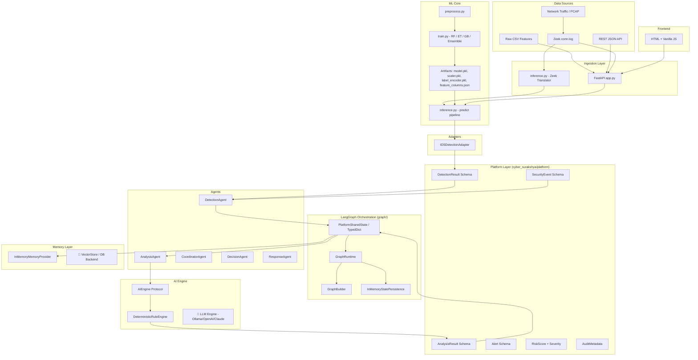

### 2.2 Layered Architecture

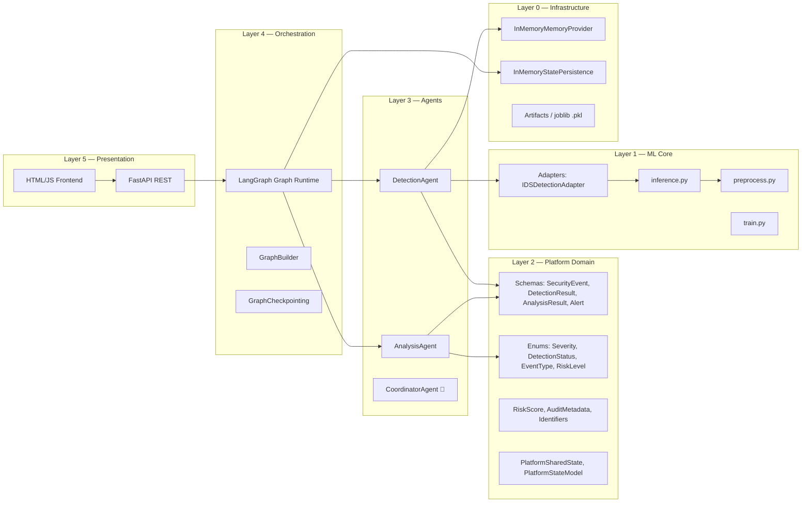

### 2.3 Key Architectural Decisions

| Decision | Choice | Rationale |
|---|---|---|
| ML framework | scikit-learn | Mature, lightweight, joblib-serialisable |
| API framework | FastAPI | Async, auto-docs, multipart file support |
| Orchestration | LangGraph (StateGraph) | Native multi-agent state passing; future LLM support |
| Domain validation | Pydantic v2 | Runtime type safety, strict `extra="forbid"` mode |
| State sharing | TypedDict + `operator.add` reducers | LangGraph-idiomatic append semantics |
| State persistence | In-memory (initial) | Pluggable via `StatePersistence` ABC |
| Feature telemetry bridge | Zeek conn.log → CICIDS2017 | Real-world network telemetry interop |
| Class imbalance | Hybrid under+oversample (no SMOTE lib) | Zero external dependency, reproducible |

---

## 3. Codebase Structure (Developer View)

```
cyber-surakshya/
│
├── app.py                         # FastAPI application entry point
├── train.py                       # End-to-end ML training pipeline
├── preprocess.py                  # Data loading, cleaning, feature selection, balancing
├── inference.py                   # Model loading, prediction, Zeek translation
├── requirements.txt               # Runtime Python dependencies
├── pytest.ini                     # Test runner configuration
│
├── frontend/
│   ├── index.html                 # Minimal prediction UI
│   └── app.js                     # Fetch-based API client
│
├── cyber_surakshya/               # Core platform domain package
│   └── platform/
│       ├── audit/
│       │   └── metadata.py        # AuditMetadata, AuditRecord
│       ├── enums/
│       │   ├── alert_status.py    # AlertStatus enum
│       │   ├── detection_status.py# DetectionStatus: BENIGN / DETECTED / INCONCLUSIVE
│       │   ├── event_source.py    # EventSource: IDS / ZEEK / SIEM / API / etc.
│       │   ├── event_type.py      # EventType: NETWORK_FLOW / AUTH_ATTEMPT / etc.
│       │   ├── risk_level.py      # RiskLevel: NEGLIGIBLE → CRITICAL
│       │   └── severity.py        # Severity: INFO(1) → CRITICAL(5)
│       ├── identifiers/
│       │   └── correlation.py     # UUID helpers: CorrelationContext, generate_*_id()
│       ├── risk/
│       │   └── score.py           # RiskScore, risk_level_from_score, severity_from_risk_score
│       ├── schemas/
│       │   ├── alert.py           # Alert schema
│       │   ├── analysis_result.py # AnalysisResult + AnalysisEvidence
│       │   ├── detection_result.py# DetectionResult (contract for all detectors)
│       │   └── security_event.py  # SecurityEvent + NetworkEndpoint
│       ├── state/
│       │   └── shared_state.py    # PlatformSharedState (TypedDict) + PlatformStateModel
│       └── validation/
│           └── rules.py           # Cross-field validators (severity↔risk, IP, port, proba)
│
├── agents/
│   ├── detection/
│   │   └── detection_agent.py     # DetectionAgent LangGraph node
│   └── analysis/
│       └── analysis_agent.py      # AnalysisAgent LangGraph node
│
├── adapters/
│   └── detection/
│       ├── base.py                # DetectionAdapter abstract base class
│       └── ids_adapter.py         # IDSDetectionAdapter (bridges inference.py → DetectionResult)
│
├── ai_engine/
│   ├── base.py                    # AIEngine Protocol + AnalysisContext dataclass
│   └── deterministic.py          # DeterministicRuleEngine (rule-based, no LLM)
│
├── graph/
│   ├── base_graph.py              # GraphLifecycleHooks (before/after build and execute)
│   ├── builder.py                 # GraphBuilder (registers and chains LangGraph nodes)
│   ├── checkpointing.py           # StatePersistence ABC + InMemoryStatePersistence
│   ├── config.py                  # GraphConfig (recursion limit, logger name)
│   └── runtime.py                 # GraphRuntime (compile, execute, load_state)
│
├── memory/
│   ├── base.py                    # MemoryProvider ABC
│   ├── exceptions.py              # MemoryRecordNotFoundError, etc.
│   ├── inmemory.py                # InMemoryMemoryProvider (thread-safe, RLock-guarded)
│   └── models.py                  # MemoryRecord, MemoryQuery, MemorySearchResult
│
├── data/
│   ├── raw/                       # Raw CICIDS2017 CSV files (not committed)
│   └── processed/                 # Cleaned/processed data (not committed)
│
├── artifacts/                     # Serialised model artifacts (model.pkl, etc.)
├── results/                       # Evaluation outputs
├── figures/                       # Training plots
│
├── tests/
│   ├── agents/
│   │   ├── test_detection_agent.py
│   │   └── test_analysis_agent.py
│   ├── adapters/
│   ├── ai_engine/
│   ├── graph/
│   ├── memory/
│   └── platform/
│
└── docs/
    ├── project_vision.md
    ├── AI_DEVELOPMENT_RULES.md
    ├── detection_agent.md
    ├── analysis_agent.md
    ├── memory_abstraction.md
    └── CyberSurakshya_Project_Proposal.docx
```

---

## 4. Module Deep-Dive

### 4.1 `cyber_surakshya/platform` — Domain Core

This is the **heart of the platform**. All domain schemas live here and are validated strictly using Pydantic v2 with `extra="forbid"`.

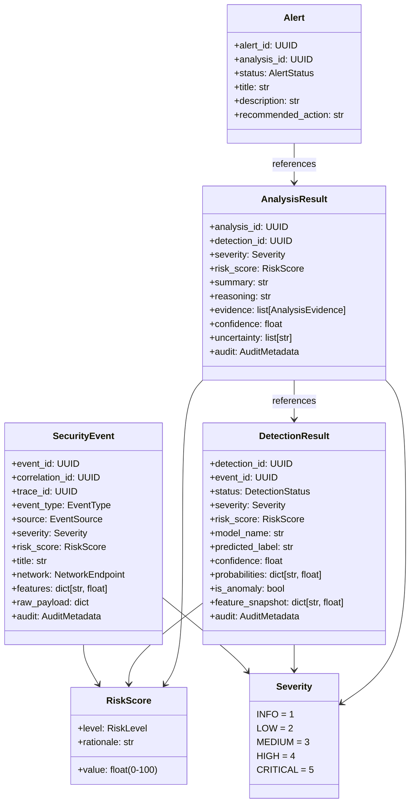

**Key validation rules:**
- Severity must align with the numeric risk score band (enforced via cross-field `model_validator`)
- `DetectionStatus.BENIGN` cannot have `is_anomaly=True`
- `DetectionStatus.DETECTED` cannot have a benign `predicted_label`
- All IDs are validated UUIDs; stored in lowercase

### 4.2 `graph/` — LangGraph Orchestration Shell

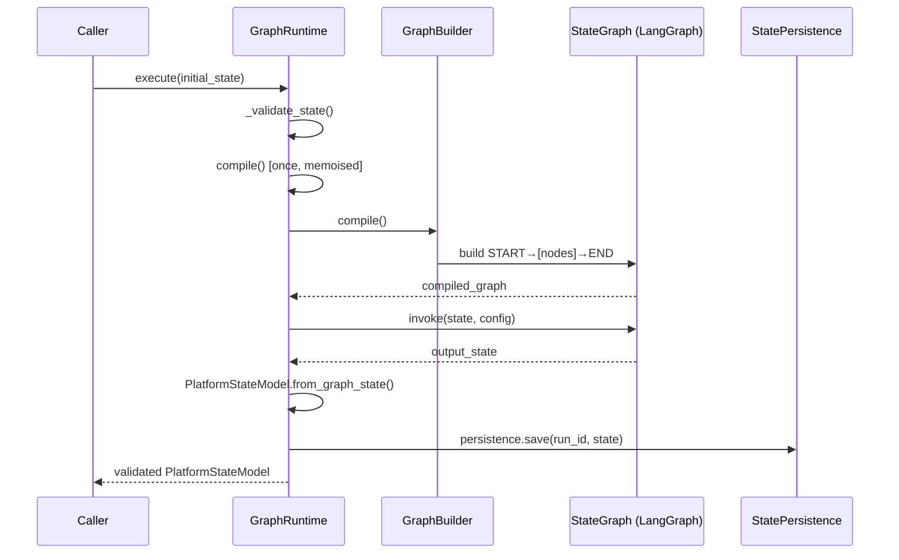

- **`GraphBuilder`** chains nodes linearly in registration order: `START → node_A → node_B → END`
- **`GraphRuntime`** wraps compile-once, execute-many semantics with pre/post hooks
- **`GraphConfig`** configures `recursion_limit` and logger name
- All hooks (`before_build`, `after_build`, `before_execute`, `after_execute`, `on_error`) are optional

### 4.3 `agents/` — Agentic Nodes

Both agents implement the **pure-function LangGraph node contract**:

```python
def __call__(self, state: PlatformSharedState) -> PlatformSharedState
```

```mermaid
flowchart LR
    A([PlatformSharedState\nin]) --> B[DetectionAgent]
    B -->|finds first undetected SecurityEvent| C[IDSDetectionAdapter.detect]
    C --> D[inference.predict]
    D --> E[DetectionResult]
    E --> F([PlatformSharedState\n+ DetectionResult appended])
    F --> G[AnalysisAgent]
    G -->|finds first unanalysed DetectionResult| H[AIEngine.analyze]
    H --> I[AnalysisResult]
    I --> J([PlatformSharedState\n+ AnalysisResult appended])
```

**Processing logic:**
- Each agent finds the *first* pending item (event/detection) that does not yet have a downstream result
- This ensures idempotent, sequential processing per workflow invocation
- Errors are caught, logged, and returned as state updates (non-crashing)

### 4.4 `adapters/detection/` — ML Bridge

`IDSDetectionAdapter` translates between the domain world (SecurityEvent → DetectionResult) and the ML world (DataFrame → prediction):

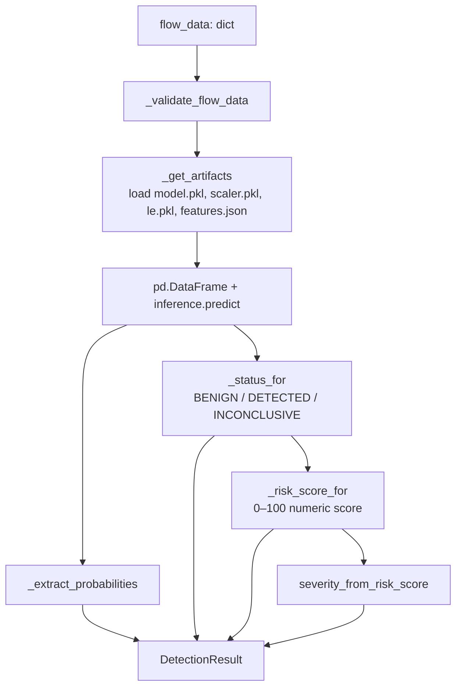

**Risk scoring logic:**
- BENIGN → risk score = 0.0
- INCONCLUSIVE (confidence < threshold) → risk = `confidence × 50`
- DETECTED → risk = `confidence × 100`

### 4.5 `ai_engine/` — Analysis Engine

`DeterministicRuleEngine` is a deterministic, LLM-free reasoning component. It:
- Mirrors detection output into structured evidence (`AnalysisEvidence`)
- Provides natural-language summaries and reasoning
- Flags uncertainty conditions (low confidence, missing probabilities, no features)
- Conforms to the `AIEngine` Protocol interface for future LLM replacement

### 4.6 `memory/` — Memory Abstraction

Thread-safe in-memory store with collection-per-domain semantics:

| Feature | Implementation |
|---|---|
| Thread safety | `threading.RLock` (re-entrant, safe for nested calls) |
| Storage model | `{collection: {record_id: dict}}` nested dictionary |
| Query | `MemoryQuery` dataclass with 10+ filter dimensions |
| Sort / Limit | `order_by`, `descending`, `limit` on any record field |
| Timestamps | UTC-aware `datetime`, auto-stamped on store/update |
| Isolation | Always returns deep copies — no shared mutable state |

---

## 5. Data & ML Pipeline

### 5.1 Training Pipeline (train.py + preprocess.py)

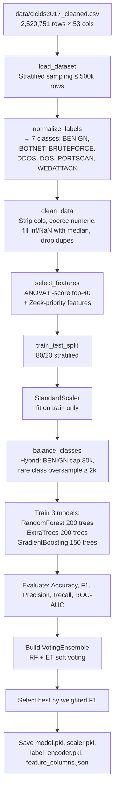

### 5.2 Attack Classes & Label Mapping

**Seven classes.** `artifacts/label_encoder.pkl` holds exactly these:

| Raw label in `cicids2017_cleaned.csv` | Normalized class | Rows | Description |
|---|---|---|---|
| Normal Traffic | BENIGN | 2,095,057 | Normal network traffic |
| Bots | BOTNET | 1,948 | Botnet C2 communication |
| Brute Force | BRUTEFORCE | 9,150 | Credential brute-force attacks |
| DDoS | DDOS | 128,014 | Distributed denial of service |
| DoS | DOS | 193,745 | Denial of service variants |
| Port Scanning | PORTSCAN | 90,694 | Port scanning reconnaissance |
| Web Attacks | WEBATTACK | 2,143 | Web application attacks (SQLi / XSS) |

> **There is no `INFILTRATION` class.** Earlier revisions of this document
> listed eight classes including infiltration. `data/cicids2017_cleaned.csv`
> contains **zero** infiltration rows, `preprocess.CLASS_ORDER` lists seven,
> and the trained encoder holds seven. The platform cannot detect infiltration
> or lateral movement at all. Adding it would mean re-deriving the cleaned
> dataset from `data/raw/Thursday-WorkingHours-Afternoon-Infilteration.pcap_ISCX.csv`.

**Served model performance** — `artifacts/model_DNN.pkl`, an `MLPClassifier`,
selected by `inference.resolve_model_path`:

| Metric | Value |
|---|---|
| Accuracy | 0.9971 |
| F1 (weighted) | 0.9970 |
| **F1 (macro)** | **0.97** |
| Recall (macro) | 0.95 |
| Weakest class | BOTNET, recall 0.74 |

Read the **macro** figures. Weighted metrics are dominated by BENIGN, DDOS, DOS
and PORTSCAN, which together are ~99% of the rows.

⚠️ `model_RandomForest.pkl`, `model_GradientBoosting.pkl` and
`model_VotingEnsemble.pkl` are saved but **not served**, and all three have
**0.08–0.10 recall on WEBATTACK**. Do not promote one to `model.pkl` without
checking its macro recall first — `resolve_model_path`'s preference order is
currently the only thing keeping the good model in production.

### 5.3 Zeek conn.log Feature Mapping

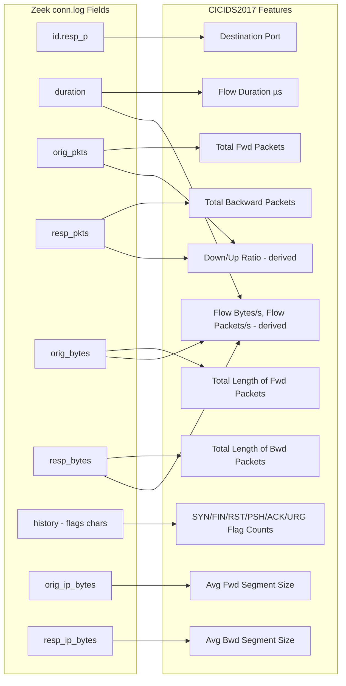

> **Note:** IAT statistics, packet-length distributions, and TCP window sizes require custom Zeek scripts beyond the default conn.log.

### 5.4 Inference Pipeline (inference.py)

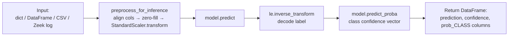

---

## 6. Platform Domain Model

### 6.1 State Machine: Detection Status

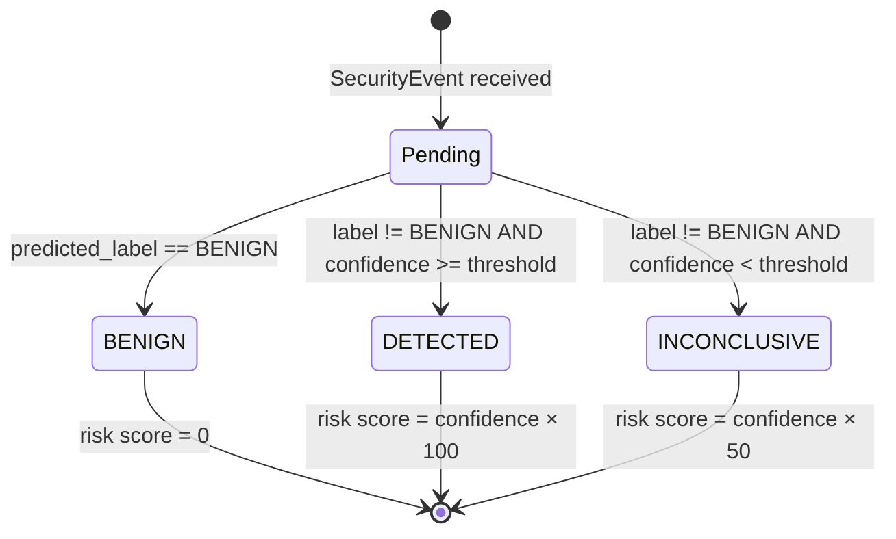

### 6.2 Risk Score → Severity Mapping

| Risk Score | Risk Level | Severity |
|---|---|---|
| 0.0 – 19.99 | NEGLIGIBLE | INFO |
| 20.0 – 39.99 | LOW | LOW |
| 40.0 – 59.99 | MODERATE | MEDIUM |
| 60.0 – 79.99 | HIGH | HIGH |
| 80.0 – 100.0 | CRITICAL | CRITICAL |

### 6.3 PlatformSharedState Flow

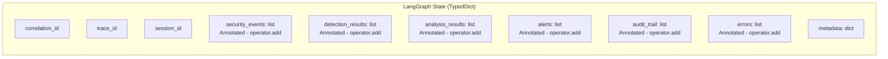

All list fields use `operator.add` as the LangGraph reducer, enabling **append-only immutable state merging** across nodes. Nodes only return their new additions — not the full state.

---

## 7. LangGraph Orchestration Shell

### 7.1 Current Graph Topology

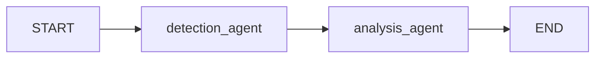

Nodes are registered and chained linearly by `GraphBuilder`. The current architecture is a sequential pipeline. Future routing (conditional edges) will be introduced as agents are added.

### 7.2 Workflow Execution Lifecycle

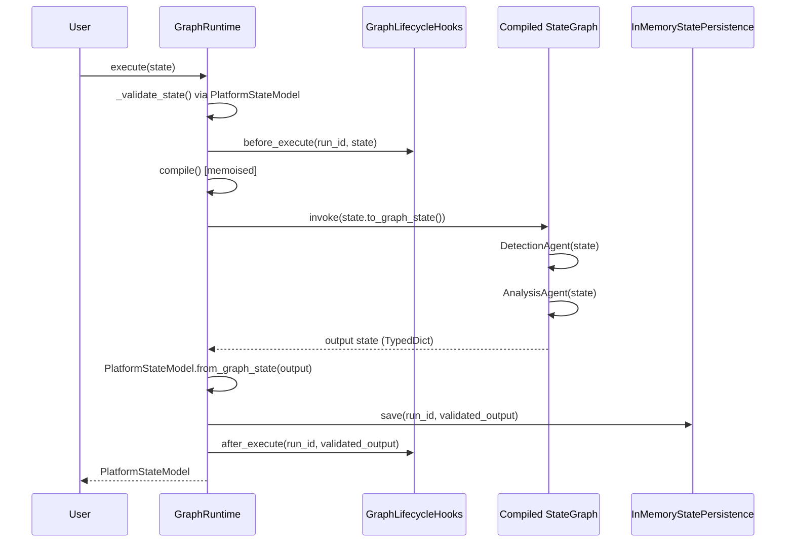

---

## 8. API & Frontend

### 8.1 REST API Endpoints

| Method | Path | Description |
|---|---|---|
| `GET` | `/health` | Check model artifact status |
| `POST` | `/predict` | JSON payload (single record or `{records: [...]}`) |
| `POST` | `/predict/csv` | Upload CSV file of flow features |
| `POST` | `/predict/zeek` | Upload Zeek conn.log (TSV) |
| `GET` | `/*` | Static frontend (served from `frontend/`) |

### 8.2 API Request/Response Flow

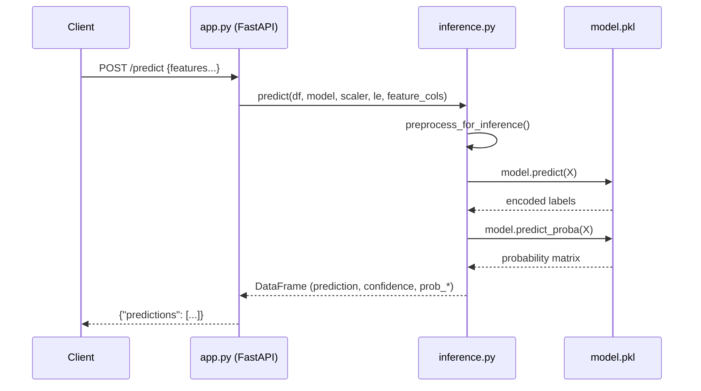

### 8.3 Frontend Capabilities

The minimal HTML/JS frontend (`frontend/index.html` + `app.js`) provides:
- JSON textarea input for single/batch prediction
- CSV file upload button
- Zeek conn.log file upload button
- `<pre>` results display with formatted JSON output

> **Note:** The frontend is intentionally minimal (proof-of-concept grade). It uses the `water.css` library for basic styling and vanilla `fetch()` calls.

---

## 9. Testing Strategy

### 9.1 Test Coverage Map

| Test Module | Agent/Component | Key Scenarios |
|---|---|---|
| `tests/agents/test_detection_agent.py` | `DetectionAgent` | Happy path, no-event skip, error propagation, state metadata |
| `tests/agents/test_analysis_agent.py` | `AnalysisAgent` | Happy path, no-detection skip, error propagation, cross-linking |
| `tests/adapters/` | `IDSDetectionAdapter` | Risk scoring, confidence thresholds, artifact loading |
| `tests/ai_engine/` | `DeterministicRuleEngine` | Evidence building, uncertainty conditions |
| `tests/graph/` | `GraphBuilder`, `GraphRuntime` | Node registration, compilation, execution, checkpointing |
| `tests/memory/` | `InMemoryMemoryProvider` | CRUD, search, thread safety |
| `tests/platform/` | All schemas | Pydantic validators, cross-field constraints |

### 9.2 Testing Approach

- **Unit tests**: Pure unit isolation using mock objects (`IDSDetectionAdapter`, `AIEngine`)
- **No integration tests yet**: No end-to-end tests combining the FastAPI layer with the agent graph
- **Test data**: Synthetic security events and detection results built in tests
- **No fixtures shared** via `conftest.py` currently (each test builds its own state)

---

## 10. Product Analysis (PM View)

### 10.1 User Personas

| Persona | Role | Primary Use Case |
|---|---|---|
| SOC Analyst | Security Operations | Triage incoming alerts, review detection confidence |
| Security Engineer | Infrastructure | Deploy and maintain Zeek + Cyber Surakshya pipeline |
| ML Engineer | Research | Train and evaluate new attack detection models |
| CISO | Leadership | Understand risk posture, get audit reports |

### 10.2 Current User Journey

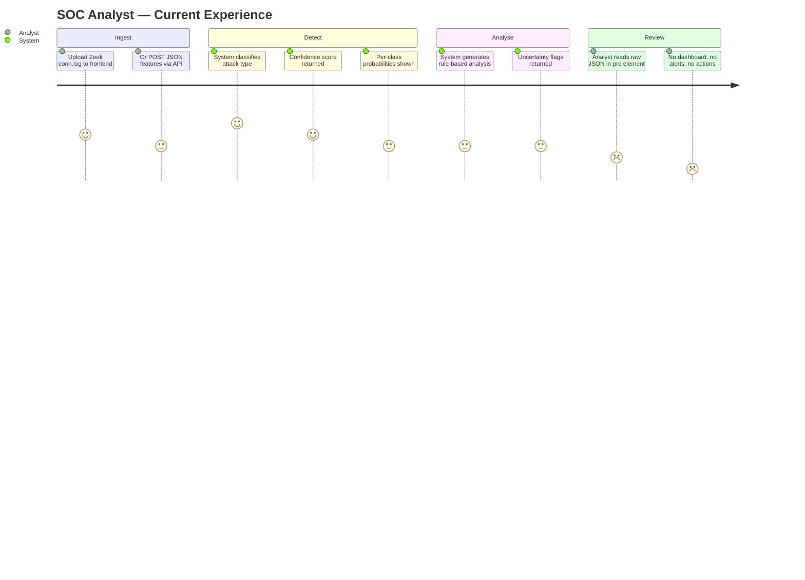

### 10.3 Feature-Value Matrix

| Feature | User Value | Technical Maturity |
|---|---|---|
| 8-class network attack classification | ⭐⭐⭐⭐⭐ | ⭐⭐⭐⭐⭐ |
| Confidence scores + class probabilities | ⭐⭐⭐⭐ | ⭐⭐⭐⭐⭐ |
| Zeek conn.log ingestion | ⭐⭐⭐⭐⭐ | ⭐⭐⭐⭐ |
| CSV batch prediction | ⭐⭐⭐ | ⭐⭐⭐⭐⭐ |
| JSON API | ⭐⭐⭐⭐ | ⭐⭐⭐⭐⭐ |
| Multi-agent orchestration (shell) | ⭐⭐⭐⭐⭐ | ⭐⭐⭐ |
| Deterministic analysis reasoning | ⭐⭐⭐ | ⭐⭐⭐⭐ |
| Alert generation | ⭐⭐⭐⭐⭐ | ⭐⭐ |
| Dashboard / visualisation | ⭐⭐⭐⭐⭐ | ⭐ |
| MITRE ATT&CK mapping | ⭐⭐⭐⭐⭐ | 🔲 |
| Automated response actions | ⭐⭐⭐⭐ | ✅ (simulated executors; real integrations pending) |

### 10.4 Strengths & Gaps

**Strengths:**
- Strong served model: macro F1 **0.97** (DNN/MLPClassifier), including 0.95 recall on web attacks
  - Read macro, not weighted: weighted F1 is 0.997 but is dominated by four high-volume classes
- Strong domain model with rigorous Pydantic validation and invariant enforcement
- Clean, extensible adapter pattern isolates ML from domain logic
- LangGraph shell enables future multi-agent expansion with minimal refactoring
- Thread-safe memory abstraction is swap-ready for Redis/Postgres/VectorDB

**Gaps:**
- Frontend is proof-of-concept grade — no visualisation, filtering, or alerting UI
- No persistent storage — all state is lost on server restart
- No real-time streaming ingestion (currently pull-based file upload only)
- No authentication or authorisation on the API
- No MITRE ATT&CK tactical mapping
- Analysis agent generates text summaries but does not produce actionable `Alert` objects yet
- Hard-coded artifact paths in `inference.py` (line 30) point to developer's local machine

---

## 11. Actionable Insights & Remaining Tasks

### 11.1 Immediate Fixes (Technical Debt)

> [!CAUTION]
> **Hard-coded local paths**: `inference.py` line 30 sets `ARTIFACT_DIR = "C:/Users/ACER/Downloads/files/artifacts"`. This must be replaced with an environment variable or config file before any deployment.

> [!WARNING]
> **Open CORS policy**: `app.py` sets `allow_origins=["*"]`. This is insecure for production and must be restricted to known origins.

> [!WARNING]
> **No authentication**: The FastAPI endpoints (`/predict`, `/predict/csv`, `/predict/zeek`) are completely unauthenticated. Add API key or OAuth2 before any external deployment.

> [!WARNING]
> **Hardcoded train.py paths**: `train.py` lines 51–52 set `ARTIFACT_DIR` and `PLOT_DIR` to `/home/claude/ids_pipeline/...` — Linux paths from a different environment. These must be parameterised.

### 11.2 Next Agent: Coordinator Agent

Per the project rules (one component at a time), the next planned agent is the **Coordinator Agent**. It should:
- Receive raw events and route them to `DetectionAgent` or skip if already processed
- Manage graph routing using LangGraph conditional edges
- Decouple event ingestion from detection logic

### 11.3 Remaining Planned Agents

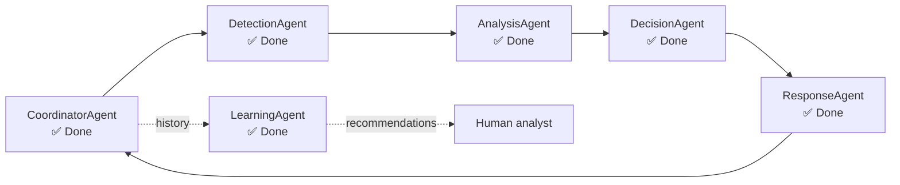

| Agent | Responsibility | Depends On | Status |
|---|---|---|---|
| **DecisionAgent** | Decide response action based on analysis | AnalysisAgent, Alert schema | ✅ Done |
| **ResponseAgent** | Authorise and execute automated or supervised responses | DecisionAgent | ✅ Done |
| **CoordinatorAgent** | Route events, drain the work queue, detect stalls, resume approval branches | All pipeline agents | ✅ Done |
| **LearningAgent** | Measure outcomes, discover patterns, recommend improvements | All memory collections + analyst feedback | ✅ Done |

**All six planned agents are complete.** The pipeline is a coordinated loop rather than a linear pass: before `CoordinatorAgent`, a run accepting N security events processed exactly one and silently dropped the rest.

`LearningAgent` sits outside the per-event loop by design — it runs over history, not per flow, and it **recommends without executing**. Its accuracy metrics depend entirely on analyst feedback: the platform cannot detect its own false positives by introspection, so `POST /learning/feedback` is the highest-value input the system takes. See `docs/learning_agent.md`.

### 11.4 Infrastructure Backlog

| Task | Priority | Effort |
|---|---|---|
| Replace `InMemoryStatePersistence` with Redis or SQLite | High | Medium |
| Replace `InMemoryMemoryProvider` with a vector store (Chroma/Weaviate) | Medium | Medium |
| Implement `Alert` generation from `AnalysisResult` | High | Low |
| Add LLM engine implementation (Ollama / OpenAI) for `AnalysisAgent` | Medium | Medium |
| MITRE ATT&CK technique mapping for detected attack types | Medium | High |
| Add real-time Zeek telemetry streaming via Kafka / WebSocket | High | High |
| Build production dashboard UI (React or Svelte) | High | High |
| Add authentication (API key / JWT) to FastAPI | Critical | Low |
| Parametrise `train.py` and `inference.py` paths | Critical | Low |
| Write integration tests (API ↔ graph ↔ agents) | High | Medium |
| Add `conftest.py` shared test fixtures | Medium | Low |
| Containerise with Docker + docker-compose | High | Medium |
| CI/CD pipeline (GitHub Actions) | Medium | Low |

### 11.5 ML Improvement Opportunities

| Opportunity | Notes |
|---|---|
| Evaluate on CIC-IDS-2018 / UNSW-NB15 datasets | CICIDS2017 is benchmark; real-world generalisation unknown |
| SMOTE for true oversampling | Current simple oversampling may cause overfitting on rare classes |
| Hyperparameter tuning via Optuna/GridSearch | Current params are hand-tuned |
| XGBoost / LightGBM / Neural Network models | May improve Infiltration and WebAttack recall |
| Evaluate on live Zeek traffic | Validate IAT zeros for those features not available in basic conn.log |
| Model versioning with MLflow | Track experiments and artifact lineage |

### 11.6 Development Rules Reference

Per `docs/AI_DEVELOPMENT_RULES.md`, the project follows these mandates:

1. **One component at a time** — never scaffold the entire project at once
2. **Always determine dependencies first** before implementing a component
3. **Each component requires**: Architecture + Folder Structure + Production Code + Tests + Documentation
4. **Follow** SOLID, Clean Architecture, LangGraph Best Practices, Security Best Practices
5. **Stop after each component** and wait for approval before proceeding

---

## Quick Start Reference

```bash
# 1. Create and activate virtual environment
python -m venv .venv
.venv\Scripts\activate   # Windows

# 2. Install dependencies
pip install -r requirements.txt

# 3. Set artifact directory (fix hardcoded path first)
set ARTIFACT_DIR=C:\path\to\artifacts

# 4. (One-time) Train the model — requires CICIDS2017 CSV files in data/raw/
python train.py

# 5. Run the inference API
uvicorn app:app --reload --host 0.0.0.0 --port 8000

# 6. Open frontend
# http://localhost:8000/

# 7. Run tests
pytest
```

---

*Generated: July 2026 — Cyber Surakshya Project Analysis*
