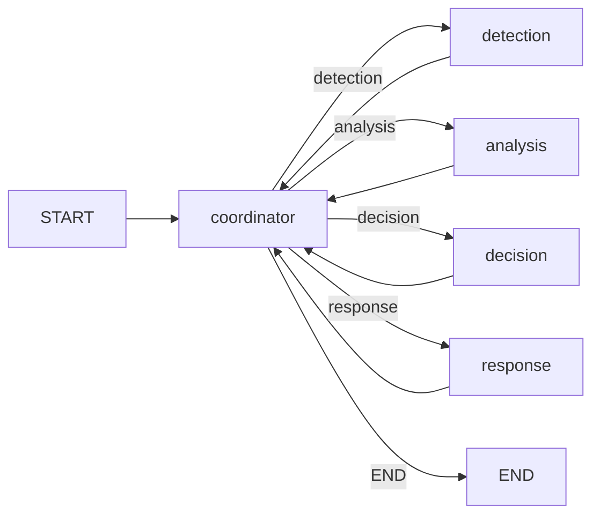

# Implementation Plan: `CoordinatorAgent` (Routing & Flow Control Node)

> Status: **IMPLEMENTED.** See `docs/coordinator_agent.md` for the as-built documentation.
> Depends on: `DetectionAgent`, `AnalysisAgent`, `DecisionAgent`, `ResponseAgent` (all complete), `GraphBuilder` (complete).
>
> **Deviations from this plan, decided during implementation:**
> 1. **Stage availability became a fourth termination guarantee** (§2 listed three). Found by a failing test: a graph registering only some stages made the coordinator route to an unregistered node, and LangGraph raised a bare `KeyError` mid-run with no attribution. `CoordinatorAgent` now takes a `stages` argument, and `GraphBuilder` validates `routable_targets` against registered nodes at **build** time.
> 2. **`GraphBuilder.register_coordinator` gained a `routable_targets` parameter** to support that build-time check without the `graph` package importing the agent layer.
> 3. **`pending` counts are absolute, not filtered to registered stages.** A partial pipeline reports work it cannot perform rather than reporting zero — hiding it would recreate the silent-drop bug this component exists to fix.

---

## 0. Why now, and why this is not cosmetic

Every agent in the platform processes **exactly one** pending item per invocation — `DetectionAgent._next_event_for_detection`, `AnalysisAgent`, `DecisionAgent._next_analysis_for_decision`, and `ResponseAgent._next_decision_for_response` all return the *first* unprocessed record and stop. The graph, meanwhile, is a single linear pass: `START → detection → analysis → decision → response → END`.

The two facts combine into silent data loss. Measured against the current build:

```
events in       : 3
detections out  : 1
analyses out    : 1
decisions out   : 1
responses out   : 1
```

Two security events were accepted, never examined, and never reported as skipped. For an IDS platform this is the most serious class of defect there is — a missed detection that leaves no trace. No existing component is responsible for fixing it: each agent is correct in isolation, and `GraphBuilder` deliberately contains no routing policy.

That responsibility is the `CoordinatorAgent`'s, and it is why this component comes before `LearningAgent`.

It also collects the branch `ResponseAgent` created: a run ending in `AWAITING_APPROVAL` needs something to route it back to execution once an analyst rules.

---

## 1. Boundary Contract

```
PlatformSharedState ──► CoordinatorAgent ──► RouteDecision ──► {detection | analysis | decision | response | END}
```

### DOES
- Compute pending work per stage from state, as a pure function.
- Choose the next node to run, or END.
- Drain the queue: keep dispatching until every event has traversed the pipeline.
- Detect **stalls** — a stage that ran but produced no progress — and stop dispatching to it.
- Enforce an iteration budget so a graph run always terminates.
- Route a resumable `AWAITING_APPROVAL` decision back to `ResponseAgent`, at most once per run.
- Record a run summary in `metadata["coordinator_agent"]`.

### DOES NOT
- Perform detection, analysis, decision, or response work of its own.
- Read or interpret domain payloads (features, labels, risk scores, actions).
- Mutate any result list. It is the only agent that appends **nothing** to state.
- Call an executor, a memory provider, or an LLM.
- Decide *what* an agent should do — only *whether it should run next*.

---

## 2. Termination Safety (the hard part)

Introducing a loop into a graph whose nodes swallow their own exceptions creates a live-lock risk that does not exist today.

`DetectionAgent`, on failure, appends to `state.errors` and returns **without** producing a `DetectionResult`. The event therefore stays pending. A naive "route while pending work exists" coordinator would dispatch to detection forever.

Three independent guarantees, in order of precedence:

1. **Stall detection.** Before dispatching to a stage, the coordinator records that stage's input/output counts. If the stage returns and the counts are unchanged, that stage is marked `stalled` for the remainder of the run, excluded from routing, and reported in the run summary. This is the guarantee that actually matters: it converts an infinite loop into a visible, attributable failure.
2. **Iteration budget.** A hard cap (`max_iterations`, default 100) on coordinator dispatches per run. Backstop only — reaching it is itself recorded as an anomaly.
3. **Recursion limit alignment.** Each work item costs 2 super-steps (agent + coordinator). `GraphConfig.recursion_limit` defaults to 25, which a 3-event run would exceed. The builder derives the limit from `max_iterations` so the coordinator's own budget is what stops a run, not an opaque LangGraph error.

**Coordinator state must live in state, not on the instance.** `app.py` holds agents as module-level singletons reused across requests; iteration counters on `self` would leak between runs and across threads. All progress tracking goes in `metadata["coordinator_agent"]`.

---

## 3. Routing Policy

Pure function of state, evaluated in pipeline order; first stage with unstalled pending work wins:

| Order | Stage | Pending when |
|---|---|---|
| 1 | `detection` | a `SecurityEvent` has no `DetectionResult` |
| 2 | `analysis` | a `DetectionResult` has no `AnalysisResult` |
| 3 | `decision` | an `AnalysisResult` has no `DecisionResult` |
| 4 | `response` | a `DecisionResult` has no `ResponseResult` |
| 5 | `response` (resume) | a decision's only responses are `AWAITING_APPROVAL`, and resume has not been attempted this run |
| — | `END` | nothing pending, or everything remaining is stalled |

This drains breadth-first: all detections, then all analyses, and so on. Batching per stage is cheaper than per-event pipelining when a stage has fixed setup cost (model inference), and it keeps the routing rule a simple ordered scan.

### Deliberate non-goal: content-level deduplication

`OVERVIEW.md` lists "deduplicate" among coordinator duties. This plan implements **exact `event_id` duplicate** suppression only, and deliberately does **not** deduplicate by flow content.

Repeated identical flows are not noise in an IDS — they are the signal. Collapsing them would hide precisely the volumetric floods and credential-stuffing loops the platform exists to catch. Suppression by content belongs in a threat-aggregation component with an explicit time window and a counter, not in a routing node.

---

## 4. Folder Structure

```
agents/coordinator/                 # NEW — pure routing domain, no I/O
├── __init__.py
├── coordinator_agent.py            # CoordinatorAgent node + route() for conditional edges
├── routing.py                      # RouteTarget, RouteDecision, WorkQueue (pure functions)
└── exceptions.py

graph/
├── builder.py                      # EDIT — optional coordinator hub-and-spoke compile
└── config.py                       # EDIT — max_iterations, derived recursion_limit

agents/response/response_agent.py   # EDIT — AWAITING_APPROVAL is not a terminal response

tests/agents/test_coordinator_agent.py    # NEW
tests/graph/test_coordinator_graph.py     # NEW
docs/coordinator_agent.md                 # NEW
```

`GraphBuilder` keeps its existing linear behaviour when no coordinator is set, so `tests/graph/test_orchestration_shell.py` and the `register_node` contract are unaffected.

---

## 5. Graph Shape



Hub-and-spoke via `add_conditional_edges`. `CoordinatorAgent.__call__` computes and records the decision; `CoordinatorAgent.route` reads it back for the edge function, re-deriving if absent.

---

## 6. One Upstream Change

`ResponseAgent._next_decision_for_response` currently treats *any* existing `ResponseResult` as "already responded". `AWAITING_APPROVAL` is explicitly resumable, so it must not count as terminal — otherwise an approved action can never execute.

Change: a decision is selectable when it has no response, **or** when all of its responses are `AWAITING_APPROVAL`. Termination is preserved by the coordinator's once-per-run resume rule plus stall detection; `ResponseAgent` still refuses to act without a genuine analyst ruling.

---

## 7. Test Plan

| File | Coverage |
|---|---|
| `test_coordinator_agent.py` | routing order across all five stages; empty state → END; drain ordering; stall detection halts a non-progressing stage; iteration budget caps a pathological run; coordinator appends to no result list; state carries all counters (no instance state); resume routed once and only once; run summary contents. |
| `test_coordinator_graph.py` | **3 events in → 3 detections, 3 analyses, 3 decisions, 3 responses** (the regression this component exists to prevent); a failing agent produces a stalled stage and a terminating run rather than a hang; linear mode still compiles without a coordinator; recursion limit derived from `max_iterations`. |
| existing suites | all 154 non-memory tests stay green. |

---

## 8. Build Order

1. `routing.py` + `exceptions.py` — pure, fully unit-testable.
2. `coordinator_agent.py` + `__init__.py`.
3. `graph/builder.py` + `graph/config.py`.
4. `ResponseAgent` resume fix.
5. `app.py` wiring; verify 3-in/3-out.
6. Tests, `docs/coordinator_agent.md`, `OVERVIEW.md`.

Per AI_DEVELOPMENT_RULES §7, work stops after step 6. `LearningAgent` is the next approval gate.
