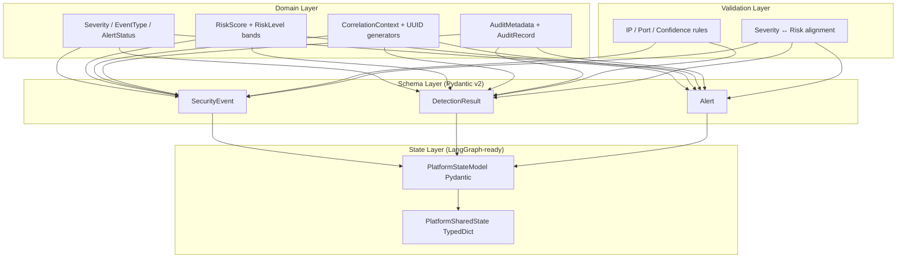

# Shared Platform State & Security Event Schema

This document describes the first approved Cyber Surakshya platform component: shared domain models, Pydantic schemas, validation rules, and LangGraph-compatible state definitions.

## Why This Component Exists

The existing IDS pipeline (`inference.py`) produces predictions but has no standardized contract for how security observations flow through a multi-agent platform. Before any agent (Detection, Analysis, Decision, Response, Coordinator) is implemented, the platform needs a single source of truth for:

- What a **security event** looks like
- How **detection results** are structured
- How **alerts** are represented
- How **severity** and **risk scores** relate
- How **correlation IDs** propagate through workflows
- What **LangGraph shared state** contains

This component provides that foundation without implementing agents, orchestration, or LangGraph workflows.

## Architecture



### Design Principles

| Principle | Application |
|-----------|-------------|
| **Single Responsibility** | Each module owns one concern (enums, identifiers, schemas, validation, state) |
| **Open/Closed** | Schemas extend via metadata dicts and labels without modifying core fields |
| **Dependency Inversion** | Future agents depend on schema contracts, not concrete implementations |
| **Validation at boundaries** | Pydantic models enforce rules at ingestion and state hydration |
| **LangGraph compatibility** | `PlatformSharedState` uses `Annotated[list, operator.add]` reducers for append semantics |

## Folder Structure

```
cyber_surakshya/
├── __init__.py
└── platform/
    ├── __init__.py                 # Public API re-exports
    ├── enums/
    │   ├── severity.py             # Severity (INFO → CRITICAL)
    │   ├── risk_level.py           # Risk bands (NEGLIGIBLE → CRITICAL)
    │   ├── event_type.py           # Event taxonomy
    │   ├── event_source.py         # Originating systems
    │   ├── detection_status.py     # Detection outcomes
    │   └── alert_status.py         # Alert lifecycle
    ├── identifiers/
    │   └── correlation.py          # UUID correlation/trace/session IDs
    ├── audit/
    │   └── metadata.py             # AuditMetadata, AuditRecord
    ├── risk/
    │   └── score.py                # RiskScore, severity mapping
    ├── schemas/
    │   ├── security_event.py       # SecurityEvent, NetworkEndpoint
    │   ├── detection_result.py     # DetectionResult
    │   └── alert.py                # Alert
    ├── validation/
    │   └── rules.py                # Shared validators
    └── state/
        └── shared_state.py         # PlatformSharedState, PlatformStateModel

tests/platform/
├── conftest.py                     # Shared fixtures
├── test_identifiers.py
├── test_risk_score.py
├── test_schemas.py
├── test_shared_state.py
└── test_validation.py

docs/platform/
└── shared_state_schema.md          # This document
```

## Severity & Risk Score Definitions

### Severity Levels

| Level | Value | Use Case |
|-------|-------|----------|
| INFO | 1 | Informational telemetry |
| LOW | 2 | Minor suspicious activity |
| MEDIUM | 3 | Notable anomaly requiring review |
| HIGH | 4 | Likely attack or policy violation |
| CRITICAL | 5 | Active threat requiring immediate action |

### Risk Score Bands (0–100)

| Band | Range | Maps to Severity |
|------|-------|------------------|
| NEGLIGIBLE | 0 – 19.99 | INFO |
| LOW | 20 – 39.99 | LOW |
| MODERATE | 40 – 59.99 | MEDIUM |
| HIGH | 60 – 79.99 | HIGH |
| CRITICAL | 80 – 100 | CRITICAL |

Validation allows one severity level of drift from the expected mapping to support analyst overrides.

## Schema Reference

### SecurityEvent

Canonical observation record. Links to correlation/trace IDs, carries network endpoint details, optional IDS feature snapshot, and audit metadata.

### DetectionResult

Structured IDS/detection output. References a parent `event_id`, includes model metadata, predicted label, confidence, probabilities, and risk score. Does **not** execute detection — only defines the contract.

### Alert

Elevated finding aggregating one or more events and detections. Enforces lifecycle rules (e.g. resolved alerts require `resolved_at`).

### PlatformSharedState

LangGraph TypedDict with append reducers for list fields. Future workflow nodes will merge outputs into shared state using these reducers.

## Usage Examples

```python
from cyber_surakshya.platform import (
    AuditMetadata,
    CorrelationContext,
    DetectionResult,
    EventSource,
    EventType,
    RiskScore,
    SecurityEvent,
    Severity,
    create_initial_state,
)

ctx = CorrelationContext.create()
audit = AuditMetadata(
    created_by="ids",
    updated_by="ids",
    source_system="ids",
)

event = SecurityEvent(
    correlation_id=ctx.correlation_id,
    trace_id=ctx.trace_id,
    event_type=EventType.NETWORK_FLOW,
    source=EventSource.IDS,
    severity=Severity.HIGH,
    risk_score=RiskScore(value=72.5),
    title="Suspicious flow",
    audit=audit,
)

state = create_initial_state(ctx)
graph_state = state.to_graph_state()  # LangGraph-ready dict
```

## Running Tests

```bash
pip install pydantic>=2.0 pytest
pytest tests/platform -v
```

## Out of Scope (This Component)

- Detection Agent
- Analysis Agent
- Decision Agent
- Response Agent
- Coordinator Agent
- LangGraph workflow graphs
- Orchestration logic

## Next Steps (Requires Approval)

After this component is approved, the next component may wire the existing IDS inference pipeline to emit `DetectionResult` records conforming to these schemas.
